# 聚数云电商系统集成官网 UI/UX 设计规范

## 概述

基于聚数云电商系统集成平台的业务需求，本文档定义了官网的UI/UX设计规范，旨在为企业用户提供专业、高效、易用的数字化体验。

### 设计目标
- 建立专业可信赖的企业品牌形象
- 提供直观清晰的产品信息展示
- 优化用户转化漏斗和业务流程
- 确保跨设备的一致性用户体验

### 目标用户画像
- **企业决策者**: 关注ROI和业务价值，需要快速了解核心优势
- **技术负责人**: 关注技术架构和集成能力，需要详细的技术信息
- **运营人员**: 关注操作便捷性和功能完整性，需要功能演示
- **系统管理员**: 关注系统稳定性和维护成本，需要技术支持信息

## 设计系统

### 色彩规范

#### 主色调
```
品牌主色 (Primary Blue): #1890FF
- 用途: 主要CTA按钮、链接、导航激活状态
- RGB: 24, 144, 255
- HSB: 210°, 91%, 100%

品牌深色 (Dark Blue): #0050B3  
- 用途: 标题文字、重要信息强调
- RGB: 0, 80, 179

品牌浅色 (Light Blue): #E6F7FF
- 用途: 背景色、卡片hover状态
- RGB: 230, 247, 255
```

#### 辅助色彩
```
成功色 (Success Green): #52C41A
- 用途: 成功状态、正向数据展示
- RGB: 82, 196, 26

警告色 (Warning Orange): #FA8C16  
- 用途: 警告提示、重要提醒
- RGB: 250, 140, 22

错误色 (Error Red): #FF4D4F
- 用途: 错误状态、删除操作
- RGB: 255, 77, 79

中性色 (Neutral Gray): #8C8C8C
- 用途: 辅助文字、边框、背景
- RGB: 140, 140, 140
```

#### 文字色彩层级
```
标题文字: #262626 (rgba(0,0,0,0.85))
正文文字: #595959 (rgba(0,0,0,0.65)) 
辅助文字: #8C8C8C (rgba(0,0,0,0.45))
占位文字: #BFBFBF (rgba(0,0,0,0.25))
```

### 字体系统

#### 字体族
```css
/* 中文字体 */
font-family: -apple-system, BlinkMacSystemFont, 'PingFang SC', 'Hiragino Sans GB', 'Microsoft YaHei', '微软雅黑', Arial, sans-serif;

/* 英文和数字 */
font-family: -apple-system, BlinkMacSystemFont, 'Segoe UI', Roboto, 'Helvetica Neue', Arial, sans-serif;

/* 等宽字体(代码) */
font-family: 'SF Mono', Monaco, 'Cascadia Code', 'Roboto Mono', Consolas, 'Courier New', monospace;
```

#### 字号规范

| 层级 | 字号 | 行高 | 字重 | 使用场景 |
|------|------|------|------|----------|
| H1 | 38px | 46px | 600 | 页面主标题 |
| H2 | 30px | 38px | 600 | 章节标题 |
| H3 | 24px | 32px | 600 | 子章节标题 |
| H4 | 20px | 28px | 600 | 卡片标题 |
| H5 | 16px | 24px | 600 | 小标题 |
| Body Large | 16px | 24px | 400 | 重要正文 |
| Body | 14px | 22px | 400 | 默认正文 |
| Body Small | 12px | 20px | 400 | 辅助信息 |
| Caption | 12px | 20px | 400 | 图片说明、表单标签 |

### 间距系统

#### 基础间距单位
基于8px网格系统，所有间距使用8的倍数：
```
xs: 4px   (0.5 unit)
sm: 8px   (1 unit)  
md: 16px  (2 units)
lg: 24px  (3 units)
xl: 32px  (4 units)
xxl: 48px (6 units)
```

#### 布局间距规范

| 用途 | 间距值 | 使用场景 |
|------|--------|----------|
| 组件内边距 | 16px, 24px | 按钮、卡片、表单内部 |
| 组件外边距 | 16px, 24px, 32px | 组件之间的间隔 |
| 章节间距 | 48px, 64px | 页面大模块间隔 |
| 页面边距 | 24px, 32px | 页面左右边距 |

### 图标系统

#### 图标规范
- **样式**: 线性图标，统一2px描边
- **尺寸**: 16px, 20px, 24px, 32px
- **图标库**: Ant Design Icons + 自定义业务图标
- **颜色**: 继承父元素颜色或使用品牌色

#### 常用图标定义

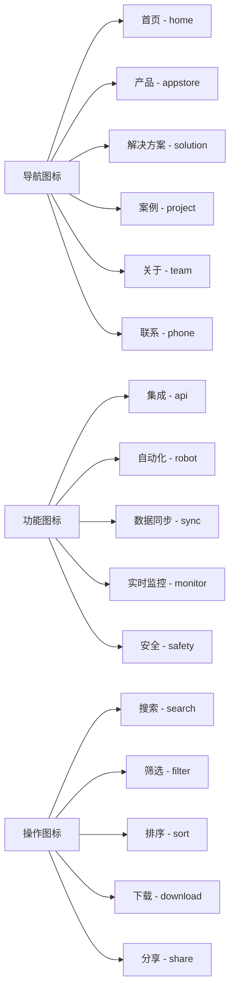

## 组件设计规范

### 按钮组件 (Button)

#### 按钮类型与状态

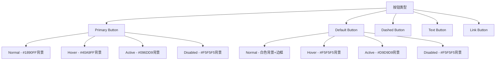

#### 按钮尺寸规范

| 尺寸 | 高度 | 内边距 | 字体大小 | 使用场景 |
|------|------|--------|----------|----------|
| Large | 40px | 16px 24px | 16px | 主要操作、Hero区域 |
| Default | 32px | 8px 16px | 14px | 常规操作、表单提交 |
| Small | 24px | 4px 8px | 12px | 表格操作、辅助功能 |

### 卡片组件 (Card)

#### 卡片结构
```
┌─────────────────────────┐
│  图标/图片 (可选)        │
├─────────────────────────┤  
│  标题 (必需)            │
│  描述文字 (可选)        │
│  操作按钮 (可选)        │
└─────────────────────────┘
```

#### 卡片样式规范
- **圆角**: 8px
- **阴影**: `0 2px 8px rgba(0,0,0,0.1)`
- **内边距**: 24px
- **边框**: 1px solid #F0F0F0
- **Hover状态**: 阴影加深 `0 4px 16px rgba(0,0,0,0.15)`

### 表单组件 (Form)

#### 表单布局
- **标签位置**: 左对齐，标签上方
- **输入框宽度**: 320px (默认), 100% (响应式)
- **标签与输入框间距**: 8px
- **表单项间距**: 24px

#### 输入框状态
```
Normal: 边框 #D9D9D9, 内边距 8px 12px
Focus: 边框 #1890FF, 外阴影 0 0 0 2px rgba(24,144,255,0.2)  
Error: 边框 #FF4D4F, 外阴影 0 0 0 2px rgba(255,77,79,0.2)
Disabled: 背景 #F5F5F5, 文字 #BFBFBF
```

## 页面布局设计

### 整体布局架构

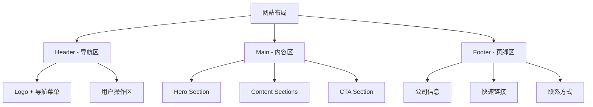

### 响应式断点设计

| 设备类型 | 屏幕宽度 | 容器宽度 | 列数 | 边距 |
|----------|----------|----------|------|------|
| Mobile | < 576px | 100% | 1 | 16px |
| Tablet | 576px - 768px | 540px | 2 | 24px |
| Laptop | 768px - 992px | 720px | 3 | 32px |
| Desktop | 992px - 1200px | 960px | 4 | 32px |
| Large | > 1200px | 1140px | 6 | 32px |

### 栅格系统

#### 24列栅格布局
```css
.container {
  max-width: 1200px;
  margin: 0 auto;
  padding: 0 32px;
}

.row {
  display: flex;
  flex-wrap: wrap;
  margin: 0 -12px;
}

.col {
  padding: 0 12px;
  flex: 0 0 auto;
}

/* 常用布局 */
.col-24 { width: 100%; }     /* 全宽 */
.col-12 { width: 50%; }      /* 二分之一 */
.col-8 { width: 33.33%; }    /* 三分之一 */
.col-6 { width: 25%; }       /* 四分之一 */
```

## 核心页面UI设计

### 首页设计 (HomePage)

#### Hero Section 设计
```
高度: 100vh (最小600px)
背景: 渐变色 linear-gradient(135deg, #1890FF 0%, #096DD9 100%)
内容布局: 左文右图 (60% : 40%)

左侧内容:
- 主标题: H1, 白色, 粗体
- 副标题: Body Large, 白色透明度80%  
- 描述文字: Body, 白色透明度70%
- CTA按钮: 大尺寸白色按钮 + 次要按钮

右侧内容:
- 产品截图或演示视频
- 浮动卡片展示核心数据
```

#### 特性展示区域
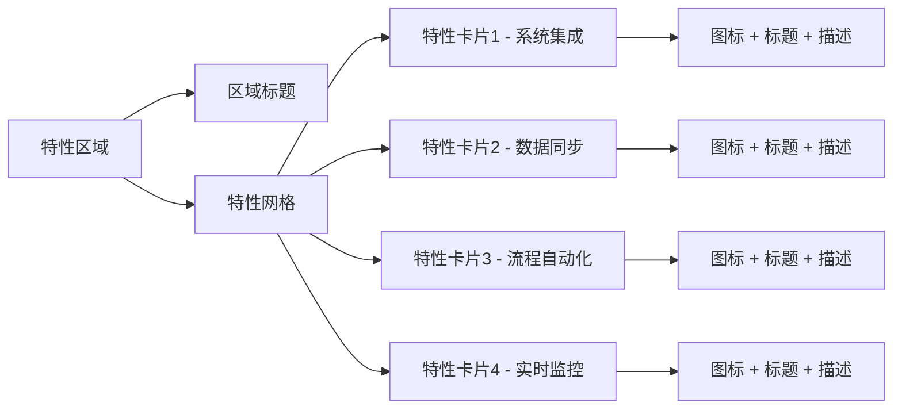

### 产品页面设计 (ProductPage)

#### 产品概览区域
- **面包屑导航**: 首页 > 产品 > 具体产品
- **产品标题**: H1 + 副标题
- **产品描述**: 简洁的价值主张
- **操作按钮**: 免费试用 + 查看演示

#### 功能模块展示
```
布局: 左右交替排列
- 奇数模块: 左文右图
- 偶数模块: 左图右文

每个模块包含:
- 功能标题 (H3)
- 功能描述 (段落文字)
- 核心特点 (列表形式)
- 相关截图/图表
```

### 解决方案页面设计 (SolutionPage)

#### 行业解决方案网格
```css
.solution-grid {
  display: grid;
  grid-template-columns: repeat(auto-fit, minmax(320px, 1fr));
  gap: 24px;
  padding: 48px 0;
}

.solution-card {
  padding: 32px;
  border-radius: 12px;
  background: white;
  box-shadow: 0 4px 12px rgba(0,0,0,0.1);
  transition: transform 0.3s ease, box-shadow 0.3s ease;
}

.solution-card:hover {
  transform: translateY(-4px);
  box-shadow: 0 8px 24px rgba(0,0,0,0.15);
}
```

#### 集成流程图
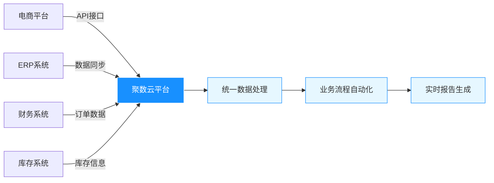

## 交互设计规范

### 动画效果设计

#### 页面过渡动画
```css
/* 页面进入动画 */
@keyframes fadeInUp {
  from {
    opacity: 0;
    transform: translateY(30px);
  }
  to {
    opacity: 1;
    transform: translateY(0);
  }
}

/* 元素hover动画 */
.interactive-element {
  transition: all 0.3s cubic-bezier(0.4, 0, 0.2, 1);
}

/* 按钮点击反馈 */
.button-click {
  transform: scale(0.95);
  transition: transform 0.1s ease;
}
```

#### 加载状态设计
- **页面加载**: 骨架屏 + 渐进式加载
- **按钮加载**: 旋转图标 + 文字变更
- **数据加载**: 占位符 + 淡入动画

### 微交互设计

#### 表单交互
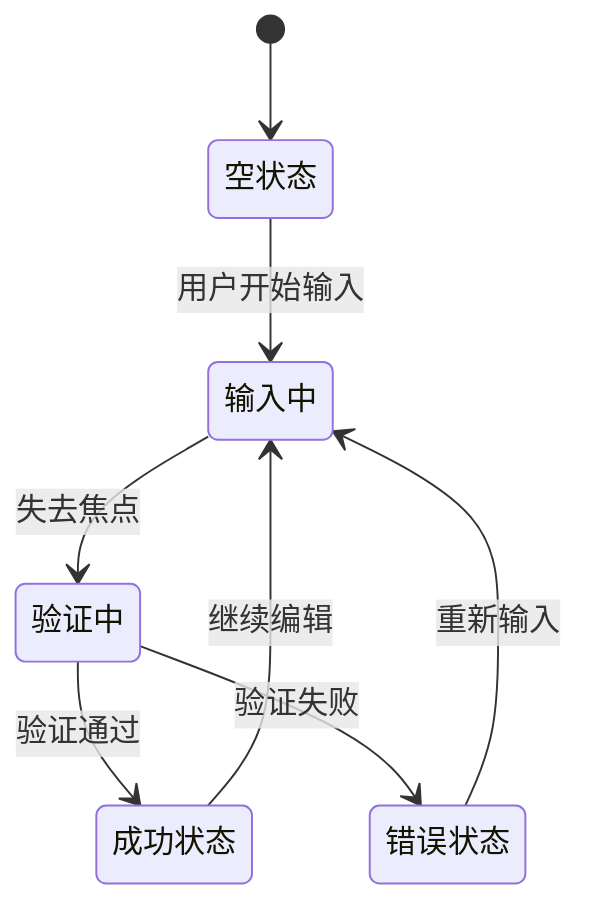

#### 反馈机制
- **成功操作**: 绿色toast提示 + 成功图标
- **错误操作**: 红色toast提示 + 错误图标  
- **警告信息**: 橙色toast提示 + 警告图标
- **加载过程**: 进度条 + 百分比显示

## 移动端适配设计

### 移动端导航设计
```
汉堡菜单 (≡) --> 全屏侧滑菜单
- 导航项垂直排列
- 每项高度 48px
- 触摸友好的间距设计
- 滑动手势关闭
```

### 触摸交互优化
- **最小触摸目标**: 44px x 44px
- **按钮间距**: 最少8px间隔
- **滑动操作**: 支持左右滑动浏览卡片
- **下拉刷新**: 标准下拉刷新交互

### 移动端表单优化
```css
/* 移动端表单样式 */
.mobile-form .form-item {
  margin-bottom: 20px;
}

.mobile-form input,
.mobile-form textarea {
  font-size: 16px; /* 防止iOS缩放 */
  padding: 12px 16px;
  border-radius: 8px;
}

.mobile-form .button {
  width: 100%;
  height: 48px;
  font-size: 16px;
}
```

## 可访问性设计

### 色彩对比度
- **正文文字**: 对比度 ≥ 4.5:1
- **大号文字**: 对比度 ≥ 3:1  
- **交互元素**: 对比度 ≥ 3:1
- **品牌色与白色**: 对比度 4.8:1 (符合AA级标准)

### 键盘导航
```css
/* 焦点样式 */
.focusable:focus {
  outline: 2px solid #1890FF;
  outline-offset: 2px;
  border-radius: 4px;
}

/* Tab顺序优化 */
.tab-sequence {
  tab-index: 0; /* 可聚焦 */
}

.skip-link {
  position: absolute;
  left: -9999px;
  top: 0;
}

.skip-link:focus {
  left: 0;
  z-index: 9999;
}
```

### 屏幕阅读器支持
- **语义化HTML**: 正确使用h1-h6标签层级
- **Alt文字**: 所有图片提供描述性替代文字
- **ARIA标签**: 为复杂交互添加aria-label
- **焦点管理**: 模态框和页面切换的焦点控制

## 性能优化设计

### 图片优化策略
```css
/* 响应式图片 */
.responsive-image {
  width: 100%;
  height: auto;
  object-fit: cover;
}

/* 懒加载占位 */
.image-placeholder {
  background: linear-gradient(90deg, #f0f0f0 25%, #e0e0e0 50%, #f0f0f0 75%);
  background-size: 200% 100%;
  animation: shimmer 2s infinite;
}
```

### 加载优化
- **关键路径优化**: 首屏内容优先加载
- **资源预加载**: 重要图片和字体预加载
- **代码分割**: 按页面分割JavaScript包
- **CDN加速**: 静态资源CDN分发

### 渲染优化
```css
/* GPU加速 */
.accelerated {
  transform: translateZ(0);
  will-change: transform;
}

/* 避免重排重绘 */
.optimized-animation {
  transform: translateX(0);
  opacity: 1;
  transition: transform 0.3s ease, opacity 0.3s ease;
}
```

## 品牌视觉设计

### Logo设计规范

#### Logo构成
```
聚数云 Logo = 图形标识 + 文字标识
- 图形标识: 抽象化的数据连接图形，体现"聚合"概念
- 文字标识: 企业名称，使用品牌定制字体
- 组合方式: 横排组合(主要)、纵排组合(辅助)
```

#### Logo使用规范
| 使用场景 | 尺寸规格 | 安全距离 | 颜色方案 |
|----------|----------|----------|----------|
| 网站Header | 120px × 40px | 左右各20px | 彩色版/白色版 |
| 移动端Header | 80px × 28px | 左右各16px | 彩色版/白色版 |
| Favicon | 32px × 32px | - | 简化图形标识 |
| 文档水印 | 60px × 20px | - | 灰色半透明 |

#### Logo禁用规范
```
禁止操作:
× 改变Logo颜色(非规定色彩)
× 拉伸变形Logo比例
× 在复杂背景上使用(对比度不足)
× 添加外框、阴影等效果
× Logo周围添加其他图形元素
```

### 品牌色彩应用

#### 色彩情感表达
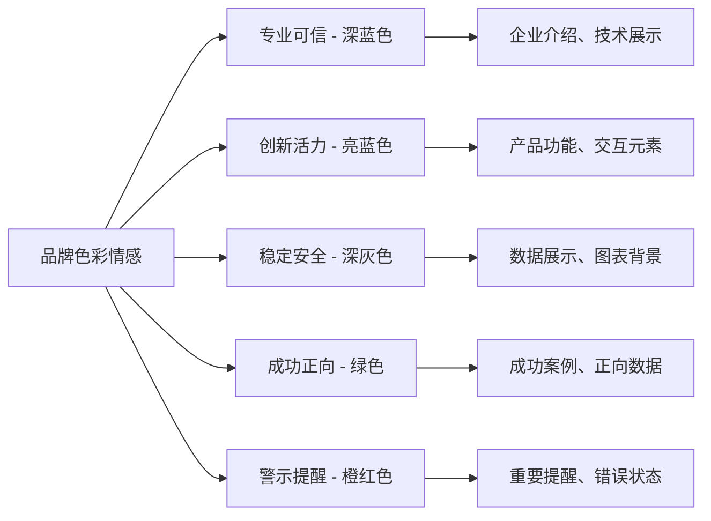

#### 色彩使用比例
```
主色调(蓝色系): 30%
- 导航、按钮、链接等核心交互元素

中性色(灰色系): 50% 
- 文字、背景、边框等基础元素

强调色(绿/橙/红): 15%
- 状态提示、数据高亮、特殊标记

背景色(白/浅灰): 5%
- 页面背景、卡片背景
```

## 数据可视化设计

### 图表设计规范

#### 图表色彩方案
```css
/* 主要数据系列 */
.chart-primary {
  --color-1: #1890FF;  /* 品牌蓝 */
  --color-2: #52C41A;  /* 成功绿 */
  --color-3: #FA8C16;  /* 警告橙 */
  --color-4: #722ED1;  /* 紫色 */
  --color-5: #13C2C2;  /* 青色 */
  --color-6: #EB2F96;  /* 品红 */
}

/* 渐变色方案 */
.chart-gradient {
  --gradient-blue: linear-gradient(180deg, #1890FF 0%, rgba(24,144,255,0.1) 100%);
  --gradient-green: linear-gradient(180deg, #52C41A 0%, rgba(82,196,26,0.1) 100%);
}
```

#### 图表组件设计

**仪表板卡片**
```
结构设计:
┌─────────────────────────┐
│ 📊 标题              ↗️ │  
│ 123,456             +12% │
│ ████████████░░░░     85% │
│ 相比上月 环比增长        │
└─────────────────────────┘

设计规范:
- 卡片尺寸: 280px × 160px
- 圆角: 12px
- 内边距: 20px
- 数值字体: 32px, 粗体
- 趋势图标: 16px
```

**趋势图表**
```css
.trend-chart {
  height: 300px;
  background: #FAFAFA;
  border-radius: 8px;
  padding: 20px;
}

.chart-line {
  stroke-width: 3px;
  stroke: #1890FF;
  fill: none;
}

.chart-area {
  fill: url(#gradientBlue);
  opacity: 0.1;
}

.chart-tooltip {
  background: rgba(0,0,0,0.8);
  color: white;
  padding: 8px 12px;
  border-radius: 6px;
  font-size: 12px;
}
```

### ROI计算器设计

#### 交互流程设计
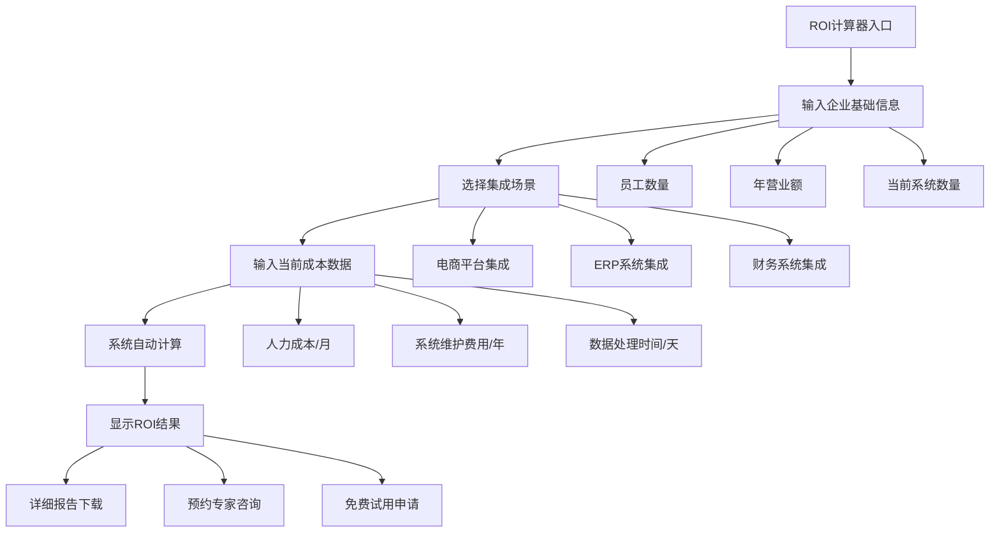

#### ROI结果展示设计
```
布局结构:
┌─────────────────────────────────────────┐
│               投资回报分析               │
├─────────────────────────────────────────┤
│  💰 年度节省成本: ¥486,000              │
│  📈 投资回报率: 240%                    │  
│  ⏱️ 回本周期: 5个月                     │
│  🎯 效率提升: 65%                       │
├─────────────────────────────────────────┤
│         成本对比图表(柱状图)            │
│   ████████ 现有成本 vs ████ 优化后成本  │
├─────────────────────────────────────────┤
│  [下载详细报告] [预约专家咨询] [免费试用] │
└─────────────────────────────────────────┘
```

## 内容策略与信息架构

### 信息层级设计

#### 导航信息架构
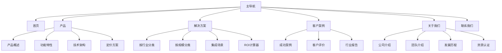

#### 内容优先级策略
```
一级内容(核心价值):
- 产品核心优势
- 客户成功案例
- 投资回报数据
- 立即试用入口

二级内容(支撑信息):
- 详细功能介绍
- 技术架构说明
- 定价方案对比
- 实施服务流程

三级内容(补充信息):
- 公司资质证书
- 团队专业背景
- 行业合作伙伴
- 技术文档资源
```

### 内容展示策略

#### 渐进式信息披露
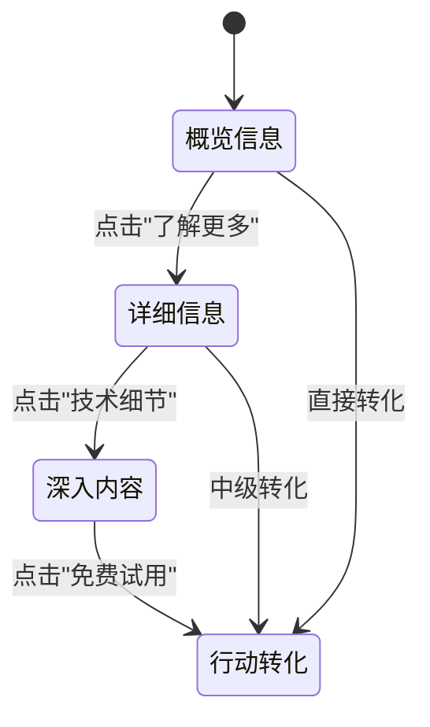

#### 信任建立策略
```
信任元素优先级:
1. 客户Logo墙 (知名企业客户)
2. 具体数据指标 (节省成本、提升效率)
3. 客户真实评价 (带头像和公司信息)
4. 资质认证展示 (ISO、SOC2等)
5. 专家团队介绍 (技术背景突出)
6. 成功案例详情 (量化的业务结果)
```

## 转化优化设计

### CTA按钮设计策略

#### CTA层级设计
```
主要CTA (Primary):
- 文案: "免费试用30天" / "立即体验"
- 颜色: 品牌蓝 #1890FF
- 位置: Hero区域、产品页面顶部
- 尺寸: Large (40px高度)

次要CTA (Secondary):
- 文案: "观看演示" / "下载资料"
- 颜色: 白色背景 + 蓝色边框
- 位置: 主CTA旁边或内容区域
- 尺寸: Default (32px高度)

辅助CTA (Tertiary):
- 文案: "了解更多" / "查看案例"
- 颜色: 文字链接样式
- 位置: 卡片底部、列表项
- 尺寸: Small (24px高度)
```

#### CTA文案优化
```
动作导向文案:
✓ "获取专属解决方案" (而非 "联系我们")
✓ "立即计算ROI" (而非 "ROI计算器")
✓ "预约专家咨询" (而非 "咨询")
✓ "下载成功案例" (而非 "案例")

紧迫感文案:
✓ "限时免费试用"
✓ "30天免费体验"
✓ "立即获取报价"
```

### 表单优化设计

#### 表单简化策略
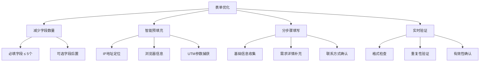

#### 表单交互优化
```css
/* 表单字段聚焦优化 */
.form-field {
  position: relative;
  margin-bottom: 24px;
}

.form-field.focused .field-label {
  transform: translateY(-20px) scale(0.8);
  color: #1890FF;
}

.form-field.error {
  border-color: #FF4D4F;
}

.form-field.success {
  border-color: #52C41A;
}

/* 进度指示器 */
.form-progress {
  display: flex;
  justify-content: space-between;
  margin-bottom: 32px;
}

.progress-step {
  flex: 1;
  height: 4px;
  background: #F0F0F0;
  margin: 0 4px;
  border-radius: 2px;
}

.progress-step.active {
  background: #1890FF;
}
```

## 国际化设计考虑

### 多语言界面设计

#### 文字长度适配
```
语言伸缩比例:
- 英文 → 中文: 0.6-0.8倍
- 中文 → 英文: 1.2-1.5倍
- 中文 → 日文: 1.0-1.2倍
- 中文 → 韩文: 1.0-1.1倍

设计应对策略:
- 按钮最小宽度: 120px
- 导航项预留30%扩展空间
- 标题区域使用可伸缩布局
- 重要信息使用图标辅助
```

#### 文化适配设计
```css
/* RTL语言支持 */
[dir="rtl"] .container {
  direction: rtl;
}

[dir="rtl"] .icon-arrow {
  transform: scaleX(-1);
}

/* 数字格式本地化 */
.number-display {
  font-variant-numeric: tabular-nums;
}

.currency {
  font-weight: 600;
}

/* 日期格式适配 */
.date-format {
  white-space: nowrap;
}
```

### 区域化内容策略

#### 内容本地化优先级
```
高优先级本地化:
- 核心价值主张
- CTA按钮文案
- 导航菜单
- 错误提示信息
- 法律条款

中优先级本地化:
- 产品功能描述
- 客户案例
- 帮助文档
- 服务条款

低优先级本地化:
- 博客文章
- 技术文档
- 开发者资源
```

## 测试与验证

### 可用性测试计划

#### 测试场景设计
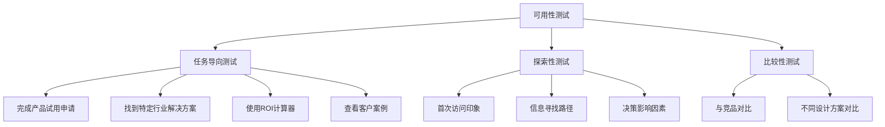

#### 测试指标定义
```
任务完成率:
- 目标: >85%
- 测量: 成功完成任务的用户比例

任务完成时间:
- 目标: <5分钟(核心任务)
- 测量: 从开始到完成的平均时间

用户满意度:
- 目标: >4.5/5分
- 测量: SUS(System Usability Scale)问卷

错误率:
- 目标: <15%
- 测量: 任务执行中的错误次数
```

### A/B测试设计

#### 测试变量设计
```
首页Hero区域:
A版本: 功能导向文案 + 产品截图
B版本: 收益导向文案 + 客户数据

CTA按钮:
A版本: "免费试用" (蓝色背景)
B版本: "立即体验" (绿色背景)

价值主张:
A版本: 技术特性强调
B版本: 商业价值强调

客户案例:
A版本: 行业Logo展示
B版本: 具体数据结果
```

#### 测试成功指标
```
转化率指标:
- 试用申请转化率: >3%
- 演示预约转化率: >1.5% 
- 资料下载转化率: >5%
- 页面停留时间: >2分钟

用户行为指标:
- 页面浏览深度: >3页
- 回访用户比例: >25%
- 社交分享次数: 提升20%
```