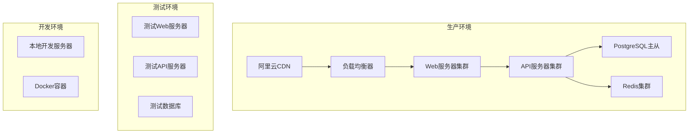
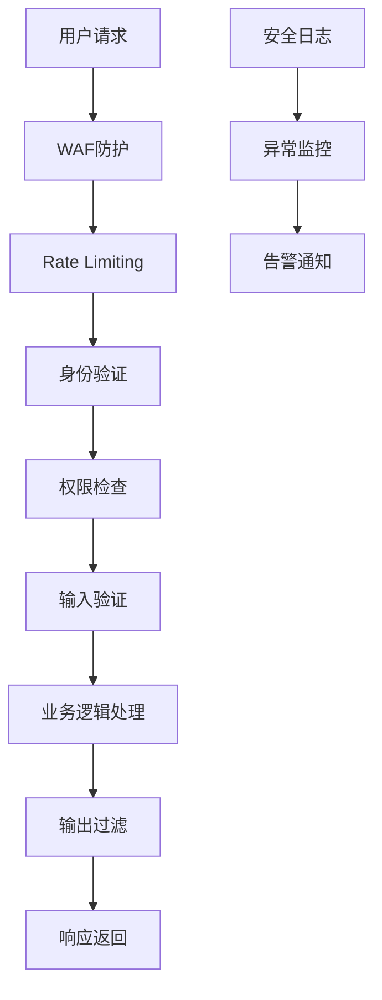
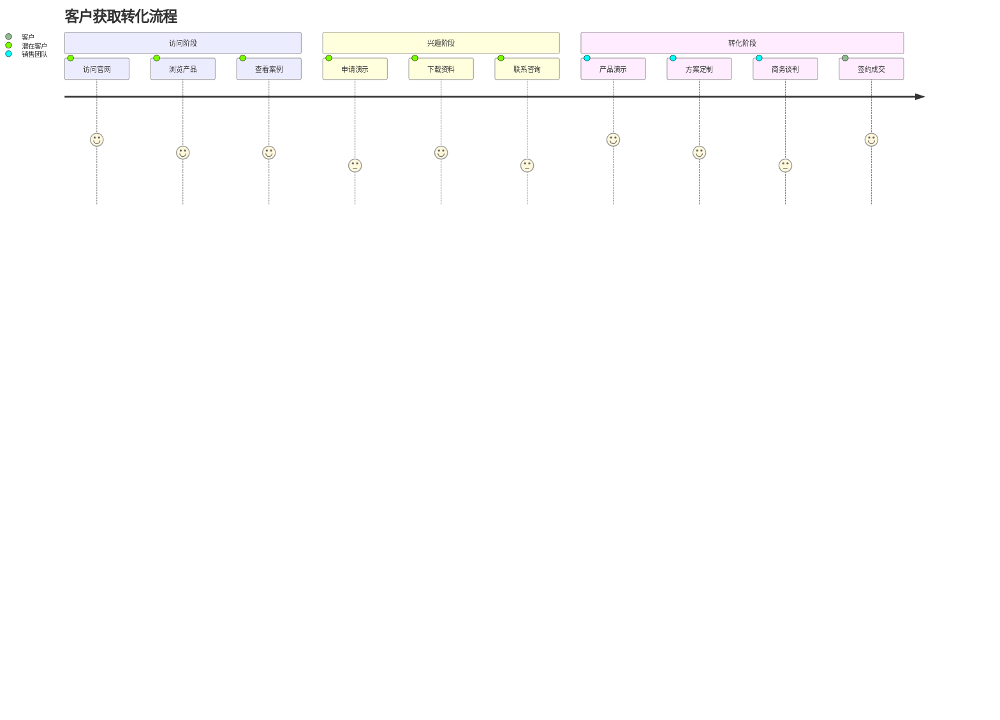
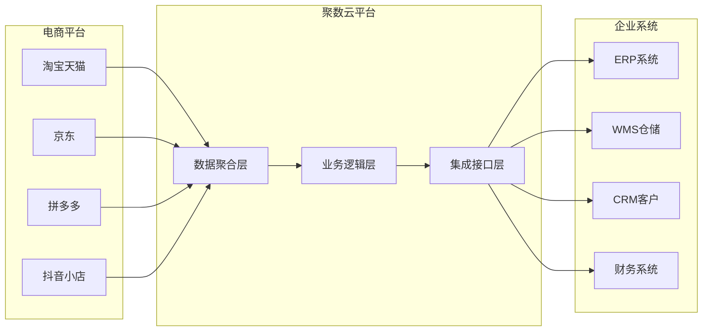
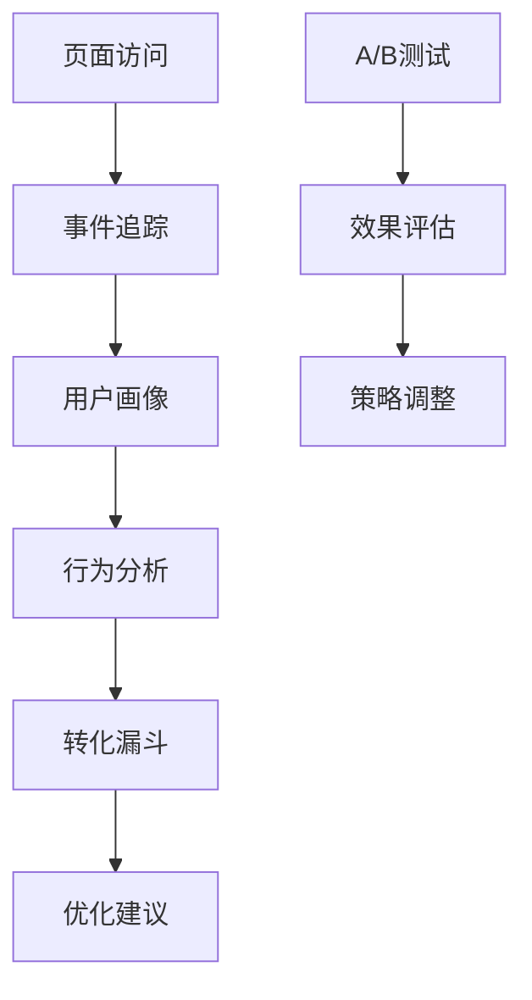
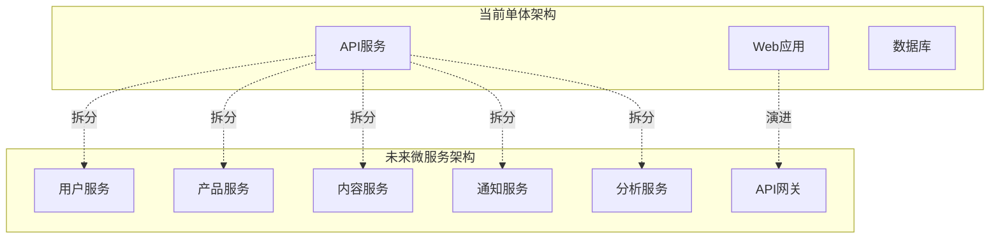

# 聚数云电商系统集成官网设计文档

## 概述

聚数云是一个专业的电商系统集成平台，致力于为电商企业提供电商平台、ERP系统及企业内部系统的无缝集成解决方案，实现业务流程的自动化和智能化管理。

### 项目目标
- 提供统一的电商系统集成解决方案展示平台
- 实现多平台数据聚合和业务流程自动化
- 为企业用户提供便捷的产品体验和服务支持
- 建立完整的客户服务和技术支持体系

### 目标用户
- 电商企业管理者和决策者
- IT系统集成负责人
- 电商运营团队
- 系统管理员和技术人员

## 技术架构

### 前端架构

#### 技术栈
- **框架**: React 18 + TypeScript
- **状态管理**: Redux Toolkit + RTK Query
- **路由**: React Router v6
- **UI组件库**: Ant Design + 自定义组件
- **样式方案**: Tailwind CSS + CSS Modules
- **构建工具**: Vite
- **代码质量**: ESLint + Prettier + Husky

#### 组件架构


#### 核心组件定义

**Layout组件**
- Props: `{ children: ReactNode, showBreadcrumb?: boolean }`
- 状态: 导航菜单展开状态、用户登录状态
- 生命周期: 页面加载时检查用户认证状态

**HeroSection组件**
- Props: `{ title: string, subtitle: string, ctaText: string, backgroundImage?: string }`
- 功能: 首页主视觉区域，包含核心价值主张和行动号召

**FeatureGrid组件**
- Props: `{ features: Feature[], columns?: number }`
- 状态: 功能卡片hover状态、动画播放状态

### 后端架构

#### 技术栈
- **框架**: Node.js + Express.js
- **数据库**: PostgreSQL + Redis
- **ORM**: Prisma
- **认证**: JWT + Passport.js
- **文件存储**: 阿里云OSS
- **监控**: PM2 + Winston

#### API端点参考

| 端点 | 方法 | 描述 | 认证要求 |
|------|------|------|----------|
| `/api/auth/login` | POST | 用户登录 | 无 |
| `/api/auth/register` | POST | 用户注册 | 无 |
| `/api/products` | GET | 获取产品列表 | 无 |
| `/api/solutions` | GET | 获取解决方案 | 无 |
| `/api/cases` | GET | 获取案例研究 | 无 |
| `/api/contact` | POST | 提交联系表单 | 无 |
| `/api/demo/request` | POST | 申请产品演示 | Bearer Token |
| `/api/admin/content` | GET/POST/PUT | 内容管理 | Admin Token |

#### 数据模型


## 页面结构设计

### 首页 (HomePage)
- **Hero区域**: 核心价值主张展示，包含产品演示申请入口
- **产品特性**: 核心功能亮点展示，使用卡片布局
- **解决方案概览**: 主要集成场景和行业应用
- **客户案例**: 成功案例轮播展示
- **客户评价**: 用户反馈和评分展示

### 产品页面 (ProductPage)
- **产品概述**: 详细功能介绍和技术优势
- **功能模块**: 分模块展示集成能力
- **技术架构**: 系统架构图和技术栈说明
- **定价方案**: 不同版本和定价策略

### 解决方案页面 (SolutionPage)
- **行业解决方案**: 按行业分类的集成方案
- **集成流程图**: 系统集成的标准流程
- **技术优势**: 平台的核心技术能力
- **ROI计算器**: 投资回报率计算工具

### 案例研究页面 (CasePage)
- **案例列表**: 按行业和规模筛选的案例
- **案例详情**: 客户挑战、解决方案、实施效果
- **数据展示**: 量化的业务改善数据

## 核心功能模块

### 用户认证与权限管理


### 产品演示申请流程


### 内容管理系统
- **页面内容管理**: 支持富文本编辑和媒体文件上传
- **产品信息管理**: 产品特性、定价、文档管理
- **案例管理**: 案例信息的增删改查和发布控制
- **用户管理**: 用户信息、权限和活动记录管理

## 状态管理架构

### Redux Store结构
```typescript
interface RootState {
  auth: {
    user: User | null
    isAuthenticated: boolean
    loading: boolean
  }
  products: {
    list: Product[]
    featured: Product[]
    loading: boolean
    error: string | null
  }
  solutions: {
    list: Solution[]
    selectedIndustry: string
    loading: boolean
  }
  ui: {
    theme: 'light' | 'dark'
    sidebarCollapsed: boolean
    notifications: Notification[]
  }
}
```

## API集成层

### HTTP客户端配置
- **基础配置**: axios实例配置，包含基础URL和默认headers
- **拦截器**: 请求拦截器添加认证token，响应拦截器处理错误
- **错误处理**: 统一的错误处理机制和用户提示
- **缓存策略**: 使用RTK Query进行数据缓存和同步

### 外部API集成
- **CRM系统**: 客户信息同步和线索管理
- **邮件服务**: 营销邮件和通知邮件发送
- **分析服务**: 用户行为分析和网站性能监控
- **客服系统**: 在线客服和工单系统集成

## 测试策略

### 单元测试
- **组件测试**: 使用React Testing Library测试组件渲染和交互
- **工具函数测试**: 使用Jest测试业务逻辑函数
- **API测试**: 使用Supertest测试API端点
- **覆盖率目标**: 代码覆盖率达到80%以上

### 集成测试
- **端到端测试**: 使用Cypress测试关键用户流程
- **API集成测试**: 测试前后端数据交互
- **数据库测试**: 测试数据库操作和数据一致性

### 性能测试
- **页面加载性能**: 使用Lighthouse进行性能评估
- **API响应时间**: 监控API响应时间和吞吐量
- **用户体验指标**: 监控Core Web Vitals指标

## 部署架构

### 环境配置


### 服务器配置
- **Web服务器**: Nginx + PM2，支持静态文件服务和反向代理
- **API服务器**: Node.js集群模式，支持水平扩展
- **数据库**: PostgreSQL主从复制，Redis哨兵模式
- **监控**: 阿里云云监控 + 自定义监控面板

## 安全策略

### 数据安全
- **数据加密**: 敏感数据使用AES-256加密存储
- **传输安全**: 全站HTTPS，TLS 1.3协议
- **数据备份**: 数据库每日自动备份，异地存储
- **访问控制**: IP白名单 + 防火墙规则

### 应用安全


- **输入验证**: 严格的参数验证和SQL注入防护
- **XSS防护**: 内容安全策略(CSP)和输出编码
- **CSRF防护**: CSRF Token验证机制
- **会话管理**: JWT Token + 刷新机制

## 性能优化

### 前端优化
- **代码分割**: 路由级别的懒加载和组件按需加载
- **资源优化**: 图片压缩、WebP格式、雪碧图
- **缓存策略**: 浏览器缓存 + Service Worker
- **首屏优化**: 关键CSS内联、预加载关键资源

### 后端优化
- **数据库优化**: 索引优化、查询优化、连接池配置
- **缓存策略**: Redis缓存热点数据、API响应缓存
- **API优化**: GraphQL聚合查询、分页优化
- **并发处理**: 异步处理、消息队列

## 业务流程设计

### 客户获取流程


### 集成方案展示


## 内容策略

### SEO优化
- **关键词策略**: 电商集成、ERP集成、系统集成解决方案
- **内容结构**: 结构化数据标记、面包屑导航
- **页面优化**: Meta标签优化、URL友好化
- **外链建设**: 行业合作伙伴链接、技术博客

### 内容管理
| 内容类型 | 更新频率 | 负责人 | 审核流程 |
|----------|----------|--------|----------|
| 产品功能 | 月度 | 产品经理 | 技术+市场双重审核 |
| 案例研究 | 季度 | 客户成功 | 客户确认+市场审核 |
| 技术博客 | 双周 | 技术团队 | 技术负责人审核 |
| 行业资讯 | 周度 | 市场团队 | 市场总监审核 |

## 数据分析与监控

### 用户行为分析


### 关键指标监控
- **流量指标**: PV、UV、跳出率、停留时间
- **转化指标**: 演示申请率、资料下载率、咨询转化率
- **用户指标**: 新老用户比例、用户路径分析
- **技术指标**: 页面加载时间、API响应时间、错误率

## 运维管理

### 日志管理
- **访问日志**: Nginx访问日志分析和存储
- **应用日志**: 结构化日志记录和集中管理
- **错误日志**: 错误追踪和告警机制
- **审计日志**: 管理操作和数据变更记录

### 备份策略
- **数据库备份**: 每日全量备份 + 实时增量备份
- **文件备份**: 静态资源和上传文件定期备份
- **配置备份**: 服务器配置和部署脚本版本控制
- **恢复测试**: 定期进行备份恢复演练

## 扩展性设计

### 微服务架构演进


### 国际化支持
- **多语言**: 中文、英文界面支持
- **本地化**: 时区、货币、日期格式适配
- **内容管理**: 多语言内容版本控制
- **SEO优化**: 多语言SEO和搜索优化